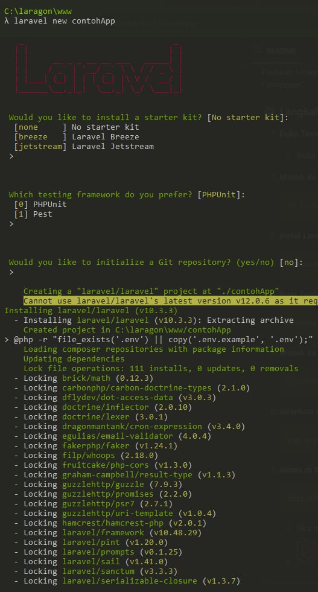
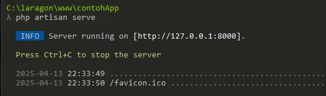
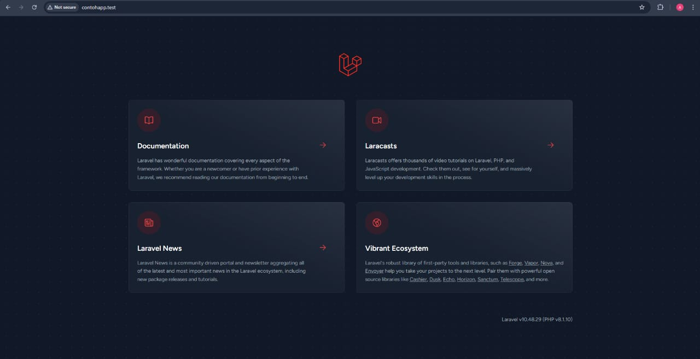

# Tutorial Instalasi Laravel menggunakan Laragon di windows

## 1. Instalasi Laragon


1. Download Laragon dari situs resminya: [https://laragon.org](https://laragon.org)
2. Jalankan installer dan ikuti petunjuk instalasi.
3. Setelah terinstal, buka Laragon dan klik `Start All`.
4. Pastikan Apache/Nginx dan MySQL berjalan.


## 2. Instalasi Laravel

### Opsi 1: Menggunakan Composer (direkomendasikan)

1. Buka terminal Laragon (`Menu > Terminal`).
2. Jalankan perintah berikut untuk membuat project Laravel baru:

   ```bash
   composer create-project --prefer-dist laravel/laravel nama-project





Akses via browser: http://127.0.0.1:8000



## 3. cara cek PHP & Composer

open terminal: menu > tools > terminal

lalu ketik: php -v
            composer -v

---
