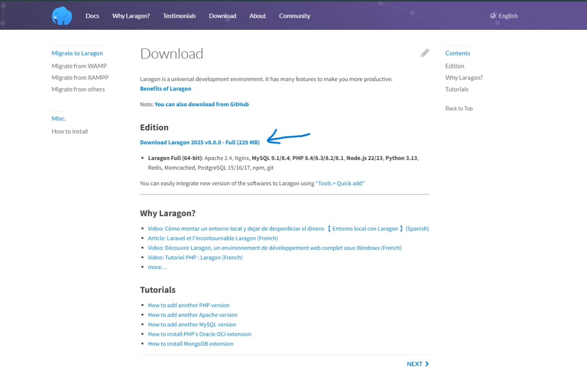
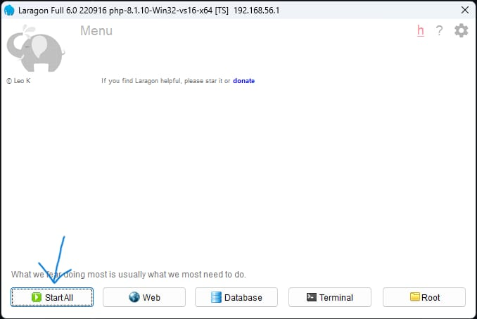

# Tutorial Instalasi Laragon & Laravel + Direktori Upload Gambar

## 1. Instalasi Laragon



1. Download Laragon dari situs resminya: [https://laragon.org](https://laragon.org)
2. Jalankan installer dan ikuti petunjuk instalasi.
3. Setelah terinstal, buka Laragon dan klik `Start All`.
4. Pastikan Apache/Nginx dan MySQL berjalan.


## 2. Instalasi Laravel

### Opsi 1: Menggunakan Composer (direkomendasikan)

1. Buka terminal Laragon (`Menu > Terminal`).
2. Jalankan perintah berikut untuk membuat project Laravel baru:

   ```bash
   composer create-project --prefer-dist laravel/laravel nama-project


   http://myapp.test

   public/uploads


http://myapp.test/uploads/nama_file.jpg

http://localhost/myapp/public


---

Kalau kamu mau saya tambahkan cara upload lewat form HTML atau Vue/React juga, tinggal bilang aja.
